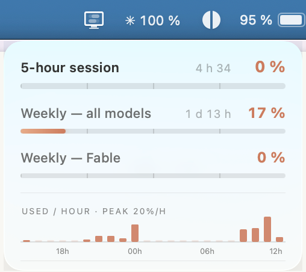
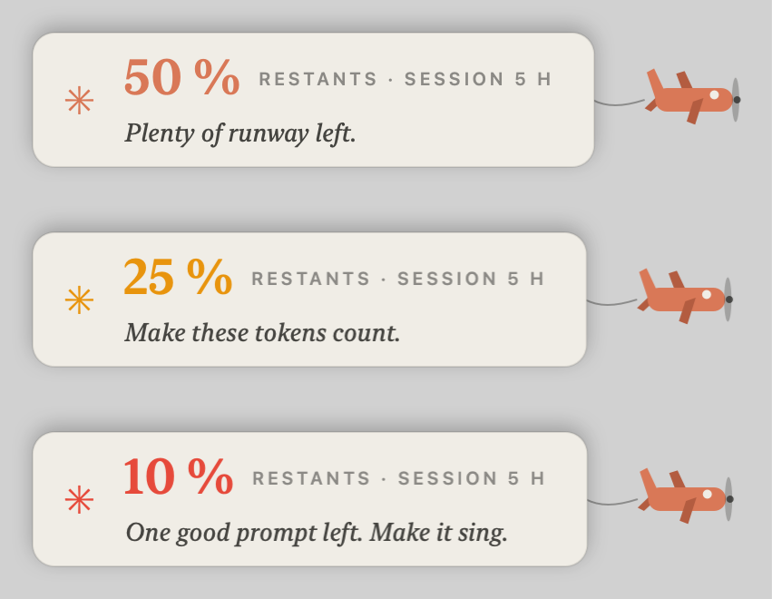

<p align="center">
  
</p>

<h1 align="center">Conso Claude</h1>

<p align="center">
  A tiny macOS menu bar app that shows your Claude usage at a glance —<br>
  and sends a little plane across your screen when you're running low.
</p>

<p align="center">
  
</p>

---

**`✳ 62 %`** sits in your menu bar — how much of your 5-hour session is **left**, always visible (coral when little remains). Click it for a compact popover: session and weekly limits as animated bars, a sparkline of your session over time, and a burn-rate prediction («&nbsp;empty ~14:30&nbsp;») when you're consuming fast enough to run dry before the reset.

<p align="center">
  
</p>

When you cross **50%, 75% and 90%** of a limit, a small coral prop plane flies across your screen towing an ivory banner: how much you have left, plus a rotating encouragement — *«&nbsp;Make these tokens count.&nbsp;»*, *«&nbsp;Maybe it's time to rest.&nbsp;»* (the pool is time-aware: late-night and Friday-evening phrases included). Once per session, never twice for the same threshold.

<p align="center">
  
</p>

> Weekend project, shared as-is — distributed as source (build it yourself, see below). **Windows** port: [`windows/`](windows/README.md).

## Install (build from source)

This app is a **companion to [Claude Code](https://claude.com/claude-code)**: it reads the OAuth token Claude Code stores in your Keychain and shows your usage. So the requirements are:

- macOS 15+, on Apple Silicon or Intel
- a **Pro/Max Claude subscription**
- **Claude Code installed and signed in** — run `claude` once and sign in with `/login`. That puts a working token in your Keychain, which this app reads. *(API-key setups — `ANTHROPIC_API_KEY`, Bedrock/Vertex — have no usage limits to show.)*

Build it yourself — no dependencies, no Xcode project, just `swiftc`. A **locally-built app is never quarantined**, so there's no Gatekeeper prompt and no notarization needed:

```bash
xcode-select --install    # once, if you don't have the Command Line Tools
git clone https://github.com/avyaravanh-lgtm/conso-claude.git
cd conso-claude
./build.sh --install      # universal binary (Apple Silicon + Intel) → /Applications, then launches
```

Right-click the ✳ icon → "Start with macOS" to make it permanent.

> **No Claude Code?** The menu has a "Sign in to Claude" button that runs the OAuth flow itself, but Anthropic's final authorization step can fail on some accounts/machines — and that's on Anthropic's side, outside this app's control. The reliable path is simply to have Claude Code signed in; then this app just works.

## How it works

- Reads Claude Code's OAuth token from the macOS Keychain (`security find-generic-password -s "Claude Code-credentials"`), at request time only.
- Queries `https://api.anthropic.com/api/oauth/usage` — the same endpoint the official "Usage limits" page uses. Exact numbers, not an estimate.
- Polite with the API: polls every 10 minutes, refreshes on popover open only if data is older than 5 minutes, silent backoff on 429 (cached data stays displayed with a ⚠ next to the timestamp).
- Usage history is kept locally (UserDefaults, 3 rolling days) for the sparkline and the dry-by prediction.
- The popover is a transparent WKWebView over the native glass; the plane is vector-drawn (`Banner.swift`) and rendered to a single texture per flight.

## Security & privacy

- The token is **never written to disk or logged**: read from the Keychain when needed, kept in memory, sent only to `api.anthropic.com` (HTTPS, hardcoded URL, ephemeral URLSession → zero disk cache).
- Keychain is accessed via absolute path (`/usr/bin/security`) — no PATH hijacking.
- No telemetry, no local server, no third-party dependencies.
- Only data persisted locally: timestamped usage percentages and the last shown phrases. Nothing sensitive.
- External data is HTML-escaped before display (anti-injection).
- The banner window ignores the mouse and captures no input.

Small enough to audit in one sitting: `main.swift` + `Banner.swift`, ~900 lines total.

## Customize the phrases

Drop a `phrases.json` in `~/Library/Application Support/Conso Claude/` to extend the pool (keys: `"50"`, `"25"`, `"10"`, `"night"`, `"friday"`, `"weekly"`, `"reset"` — arrays of strings). See the bundled [phrases.json](phrases.json) for the voice: calm, a bit literary, never guilt-tripping.

## Caveats

- The usage endpoint is not officially documented; if Anthropic changes it, the app shows a friendly error until updated.
- Distributed as source, not as a notarized download — building it locally is what keeps it out of Gatekeeper's way (no Apple Developer account needed).
- If the menu bar shows `✳ !` or "Not signed in": make sure Claude Code is signed in on this Mac (`claude` → `/login`), then right-click the icon → **Refresh**. The in-app "Sign in to Claude" button exists too, but the reliable path is the Claude Code token.

---

*Built in an afternoon with [Claude Code](https://claude.com/claude-code). Docs en français : [README.fr.md](README.fr.md).*
